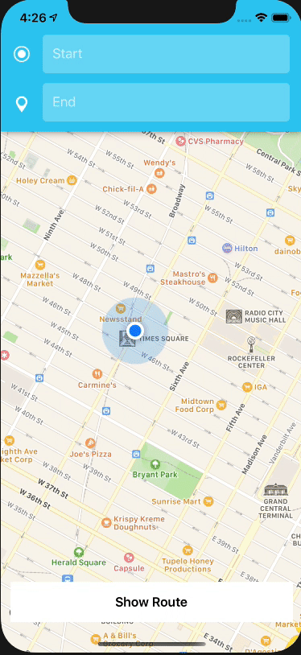

# Map It!

Map It! is a collection of controllers used with Apple's MapKit and Google's Places SDK.

### Controller 1

Controller 1 allows for users to find nearby places using Googles Places SDK and adds the places in the form of annotations to the map.

### Controller 2

Controller 2 allows for users to search for directions from one place to another and view the route!

### Controller 3

Controller 3 allows for users to search for key places nearby such as Sushi, Nail Salons, etc.

